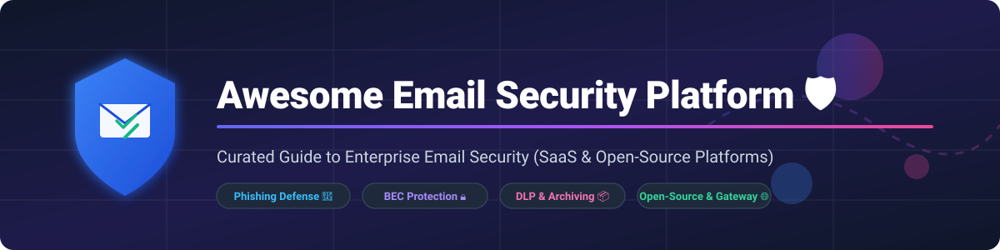

# 🛡️ Awesome Email Security Platform

  
  
  
  

> **Curated List of SaaS Email Security Platforms & Open-Source GitHub Projects**  
> *Focused on Enterprise Phishing Defense, Business Email Compromise (BEC) AI Protection, Data Loss Prevention (DLP), Spam Filtering, and Secure Email Gateway (SEG) Infrastructure.*

---

## 💡 Overview & Market Landscape

Email remains the primary attack vector for cyber threats, phishing, and ransomware. Modern email security solutions fall into two main categories:
1. **Secure Email Gateways (SEG)**: Traditional MX-record inline email filtering and scanning engines.
2. **Integrated Cloud Email Security (ICES)**: API-based AI security layers that baseline user communication patterns to stop Business Email Compromise (BEC) and social engineering attacks.

### 📊 Sector Market Size & Concentration

> 📈 **Market Size & Structure**: The global email security market is estimated at **~$8 Billion in 2026** and is projected to reach **~$20 Billion by 2032** (growing at ~11.5% CAGR). The market sector is **moderately fragmented** with major enterprise suite vendors (Microsoft, Cisco, Check Point), specialized email security leaders (Proofpoint, Mimecast), and high-growth AI-native ICES pioneers (Abnormal Security, Perception Point, IRONSCALES). There is no single winner-take-all monopoly; modern enterprises frequently deploy multi-layered defense stacks combining native cloud security with API-driven AI threat detection.

---

## 📖 Table of Contents

- [☁️ SaaS & Cloud Email Security Platforms](#%EF%B8%8F-saas--cloud-email-security-platforms)
- [🔓 Open-Source GitHub Projects](#-open-source-github-projects)
- [🤝 How to Contribute](#-how-to-contribute)
- [💖 Support & Community](#-support--community)
- [⭐ Star History](#-star-history)
- [⚠️ Disclaimer](#%EF%B8%8F-disclaimer)

---

## ☁️ SaaS & Cloud Email Security Platforms

Below is a comparative breakdown of leading enterprise SaaS email security platforms, sorted by **Company Size / Revenue / Valuation (Descending)**.

| Platform 🏢 | Description 📝 | Starting Tier Pricing 💰 | Free Tier / Trial Limits 🎁 | Company Size / Revenue / Valuation 📊 |
|:---|:---|:---|:---|:---|
| **[Microsoft Defender for Office 365](https://www.microsoft.com/en-us/security/business/office-365-defender)** 🛡️ | **Microsoft's native cloud email security.** Delivers anti-phishing, anti-spam, Safe Links, Safe Attachments, and automated threat investigation. | **$2.00/user/month** (Plan 1 standalone) / **$5.00/user/month** (Plan 2) / Bundled in M365 E5 (~$38/user/mo) | **No perpetual free tier**. Included in 30-day M365 Enterprise trial evaluations | **~$281 Billion revenue** (Microsoft FY2025) |
| **[Cisco Secure Email](https://www.cisco.com/c/en/us/products/security/email-security/index.html)** 🌐 | **Enterprise Secure Email Gateway (formerly IronPort).** Robust inbound/outbound threat filtering, sandboxing, and DLP capabilities. | **~$2.50/user/month** (Term licenses via enterprise resellers / CDW list) | **No perpetual free tier**. 45-day enterprise evaluation trial upon request | **~$63 Billion revenue** (Cisco FY2025) |
| **[Avanan (Check Point)](https://www.avanansecurity.com/)** ⚡ | **API-based cloud email security.** Protects Microsoft 365 and Google Workspace with inline AI analysis for phishing, malware, and DLP. | **~$3.10/user/month** (Cloud Email Security Basic) | **14-day free POC trial** (hard limit of 100 users, full features enabled) | Part of Check Point (**~$2.5 Billion revenue**) |
| **[Proofpoint Email Security](https://www.proofpoint.com/)** 🎯 | **Enterprise email protection suite.** Covers targeted attack protection, security awareness training, threat intelligence, and compliance archiving. | **$2.75/user/month** (Proofpoint Essentials Business tier) | **No perpetual free tier**. 30-day free trial available for SMB/Essentials tiers | **~$1.4 Billion revenue** (Private / Thoma Bravo) |
| **[Mimecast](https://www.mimecast.com/)** 📦 | **Comprehensive cloud email management.** Integrated email security, archiving, enterprise continuity, and threat awareness. | **~$2.00/user/month** (Based on UK Govt contract benchmark: ~£23.80/user/year) | **No perpetual free tier**. 30-day enterprise evaluation trial | **~$1.0 Billion revenue** (Private / Permira) |
| **[Abnormal Security](https://abnormalsecurity.com/)** 🤖 | **AI-native BEC protection.** Connects via API to model normal human behavior and stop advanced social engineering and account takeover. | **$22.00 - $35.00/employee/year** (~$1.83 - $2.91/mo for 100-500 seats) | **No perpetual free tier**. Customized interactive trial / proof-of-concept available | **~$4.0 Billion valuation** ($300M+ ARR) |
| **[Barracuda Email Protection](https://www.barracuda.com/products/email-protection)** 🏰 | **Multi-layered email security for SMBs.** Combines gateway filtering, AI phishing defense, and M365 cloud backup. | **$5.20/user/month** (Advanced plan) / **$8.00/user/month** (Premium) | **No perpetual free tier**. 14-day full-featured free trial | **~$500 Million+ revenue** (Private / KKR) |
| **[IRONSCALES](https://ironscales.com/)** 🎣 | **Self-learning email security platform.** Combines AI threat detection with crowdsourced human intelligence and 1-click remediation. | **$1.35/mailbox/month** (Protect annual plan) / **$1.50/mo** (monthly) | **No perpetual free tier**. 14-day free trial (minimum 10 mailboxes) | **~$100 Million+ valuation** ($60M+ raised) |
| **[Perception Point](https://perception-point.io/)** 🚀 | **Prevention-as-a-Service threat protection.** Multi-layered isolation and detection engine for email and collaboration tools. | **Custom enterprise tier** (Quote-based starting ~$2.00/user/month) | **Free Forever Plan available** (Unlimited users, inbound email defense) | **~$100 Million+ valuation** ($70M+ raised) |
| **[Graphus](https://www.graphus.ai/)** 🤖 | **Automated phishing defense for SMBs.** AI-driven TrustGraph technology for automated Microsoft 365 & Google Workspace defense. | **$3.00/user/month** (Standard SMB pricing) | **No perpetual free tier**. 14-day free trial on request | Acquired by Kaseya (**Private**) |

---

## 🔓 Open-Source GitHub Projects

Explore top community-driven open-source email security platforms, spam filters, and mail server defense gateways, sorted by **GitHub Stars (Descending)**.

| Project Name 🛠️ | Description 📜 | GitHub Stars ⭐ |
|:---|:---|:---:|
| **[simple-login/app](https://github.com/simple-login/app)** 🛡️ | **Open-source email alias & security service.** Protects real email addresses with instant privacy aliases, PGP encryption, and custom domain routing. |  |
| **[stalwartlabs/mail-server](https://github.com/stalwartlabs/mail-server)** ⚡ | **Modern JMAP / IMAP / SMTP server in Rust.** Built-in security with full SPF, DKIM, DMARC, ARC, spam filtering, and rate limiting out of the box. |  |
| **[mailcow/mailcow-dockerized](https://github.com/mailcow/mailcow-dockerized)** 🐄 | **Complete open-source mail server suite.** Includes Rspamd, ClamAV, Solr, SOGo webmail, and automated DKIM/DMARC management in Docker containers. |  |
| **[Cisco-Talos/clamav](https://github.com/Cisco-Talos/clamav)** 🦠 | **De-facto open-source antivirus engine.** Widely integrated into mail gateways for detecting viruses, malware, trojans, and malicious attachments. |  |
| **[anonaddy/anonaddy](https://github.com/anonaddy/anonaddy)** 👤 | **Anonymous email forwarding platform.** Open-source email alias manager supporting custom domains, GPG key encryption, and API controls. |  |
| **[mail-in-a-box/mailinabox](https://github.com/mail-in-a-box/mailinabox)** 📦 | **Easy self-hosted mail server package.** Provides automated DNS (SPF/DKIM/DMARC), SpamAssassin, Nextcloud, and webmail security. |  |
| **[iRedMail/iRedMail](https://github.com/iRedMail/iRedMail)** 📬 | **Automated open-source mail server deployment script.** Installs Postfix, Dovecot, Amavisd-new, SpamAssassin, ClamAV, and webmail. |  |
| **[modoboa/modoboa](https://github.com/modoboa/modoboa)** 🐍 | **Modular mail hosting & management platform.** Includes built-in SPF/DKIM verification, spam quarantine, Amavis integration, and webmail. |  |
| **[rspamd/rspamd](https://github.com/rspamd/rspamd)** 🚀 | **Fast, modular spam filtering system.** High-performance engine featuring machine learning classification, fuzzy hashing, SPF/DKIM/DMARC evaluation, and Web UI. |  |
| **[mjl-/mox](https://github.com/mjl-/mox)** 🐹 | **Modern, secure mail server written in Go.** Designed for single-binary self-hosting with built-in SPF, DKIM, DMARC, IP reputation checking, and spam filtering. |  |
| **[apache/spamassassin](https://github.com/apache/spamassassin)** 🛡️ | **Classic Apache spam filter engine.** Uses text analysis, Bayesian filtering, DNS blocklists, and collaborative spam tracking databases. |  |
| **[wilson-arguello/webmailMaquita](https://github.com/wilson-arguello/webmailMaquita)** 🔒 | **Webmail suite with outbound DLP & eDiscovery.** AGPLv3 platform featuring active defense for compromised accounts, GPG signing, and compliance holds. |  |
| **[sagator/sagator](https://github.com/sagator/sagator)** 🐊 | **Antivirus & anti-spam gateway for Postfix/Sendmail.** Python gateway controller for ClamAV, SpamAssassin, SQL logging, and web quarantine. |  |

---

## 🤝 How to Contribute

Contributions are very welcome! If you know of a great email security platform or open-source tool:

1. 🍴 **Fork** this repository.
2. 📝 **Add/edit** the project entry in `README.md` following the table structure.
3. 🔍 Ensure pricing and company metrics are backed by official sources.
4. 🚀 **Submit a Pull Request** with a brief summary of the added solution.

---

## 💖 Support & Community

If you find this repository helpful, please consider supporting the project:

- ⭐ **Star** this repository to help others discover it!
- 🔀 **Fork** and share it with cybersecurity engineers and sysadmins.
- ☕ **Sponsor the Maintainer**: Buy me a coffee via the [GitHub Sponsor Dashboard](https://github.com/sponsors/ishandutta2007)!

Thank you for helping keep email security open, transparent, and accessible! 🙌

---

## ⭐ Star History

---

## ⚠️ Disclaimer

- This list is **community-curated** for educational and informational purposes only and does not constitute an endorsement.
- Email security systems process corporate communications and PII; always ensure strict compliance with GDPR, CCPA, HIPAA, and organization security policies before deployment.
